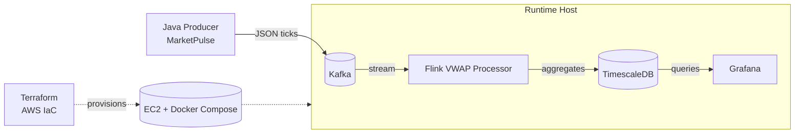
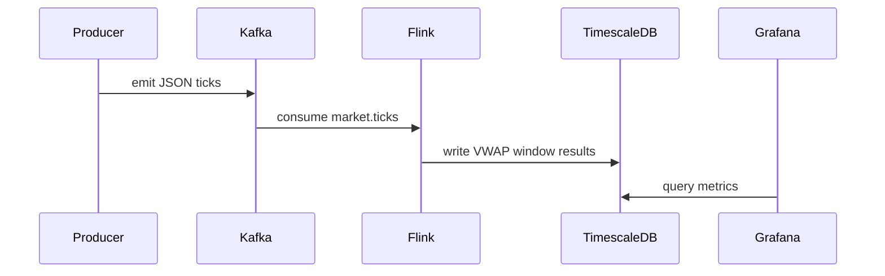
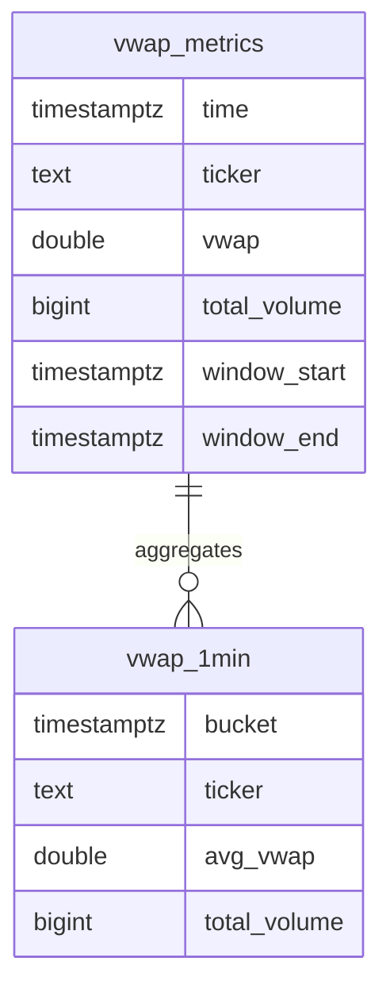

# MarketPulse

MarketPulse is a streaming market simulation and analytics stack. A Java producer generates live stock ticks, Kafka transports the stream, Flink computes rolling VWAP, TimescaleDB stores metrics, and Grafana visualizes the results.

## Architecture

## Data Flow

## Entity Relationship Diagram

The database schema lives in [init-db.sql](init-db.sql). The diagram shows core tables and the continuous aggregate view derived from them.

## Components

- Java producer: [src/main/java/com/marketpulse/ProducerApp.java](src/main/java/com/marketpulse/ProducerApp.java)
- Flink processor: [flink-processor/src/main/java/com/marketpulse/flink/FlinkProcessor.java](flink-processor/src/main/java/com/marketpulse/flink/FlinkProcessor.java)
- Local stack (Kafka, TimescaleDB, Grafana): [docker-compose.yml](docker-compose.yml)
- Infrastructure as Code (AWS): [terraform/README.md](terraform/README.md)

## Technologies Used

- Java 17
- Apache Kafka
- Apache Flink
- TimescaleDB (PostgreSQL)
- Grafana
- Docker Compose
- Terraform (AWS provisioning)

## Notes

- The Flink processor calculates VWAP over tumbling windows and persists results to TimescaleDB.
- The Terraform stack provisions an EC2 host and runs the same containerized services.
